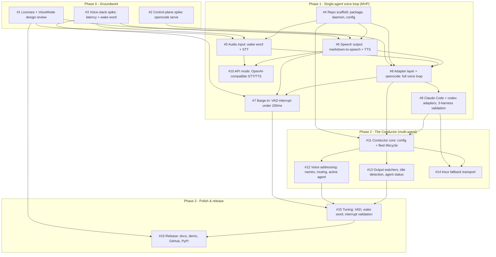

# Earshot - Issue Dependency Graph

This maps every GitHub issue for the Earshot project (voice-to-voice control for terminal coding agents) and how they depend on each other.
Issue numbers refer to this repo's GitHub issues (talibilat/vox).

## Dependency diagram

An arrow `A --> B` means "B depends on A" (A must be done, or at least stable, before B can start).

## Parallel tracks

Each track is a group of issues that separate agent sessions can work simultaneously with zero dependency overlap and zero file collision.
A track cannot start until its gate is fully merged.

| Track | Issues (parallel within the track) | Gated by | Why they don't collide |
|---|---|---|---|
| 1 | #1, #2, #3, #4 | Nothing. Start all four now. | Three spikes write only docs and throwaway scripts; the scaffold creates the package skeleton. Zero shared files. |
| 2 | #5, #6 | Track 1 complete (scaffold + both relevant spikes + license gate) | Input pipeline (`earshot/stt/`, `earshot/wakeword/`, `audio/capture.py`) vs output pipeline (`earshot/tts/`, `earshot/speakable/`, `audio/playback.py`) are disjoint modules. |
| 3 | #8, #10 | #5 and #6 merged (#8 also needs #2) | Agent adapter + loop (`earshot/agents/`, `loop.py`, `daemon.py`) vs API voice backends (`stt/api_openai.py`, `tts/api_openai.py`). No overlap. |
| 4 | #7, #9 | #8 merged | Barge-in touches audio and loop internals; the two new adapters touch only `earshot/agents/`. No overlap. |
| 5 | #11 (solo) | #9 merged (#10 should also be merged first; both edit `earshot/config.py`) | Rewires the daemon and extends config; too central to share with anything. |
| 6 | #12, #13, #14 | #11 merged | Addressing/routing vs watchers/status vs tmux adapter live in disjoint files. #12 and #13 must agree the read/status interface signatures up front. |
| 7 | #15, then #16 | All of Phase 1 + 2 merged | Sequential: release documents the numbers that tuning produces. |

The critical path is: Track 1 -> #5/#6 -> #8 -> #9 -> #11 -> Phase 2 fan-out -> #15 -> #16.
P0-02 proved that opencode status should derive from `session.next.step.ended` with `finish: "stop"`; #13 must not rely on `session.idle`, which exists in the schema but was not emitted in the spike.

## How to read this

Each box is one GitHub issue; the four large groups are the project's phases, which run mostly in order.
Follow the arrows to see what has to exist before an issue can start: an issue with no incoming arrows can start immediately, and the four such issues (the three Phase 0 spikes plus the repo scaffold) are the whole of Track 1.
If you are deciding what to hand to a new agent session, use the parallel-tracks table instead of the diagram: pick any unclaimed issue in the current track, since everything within a track is safe to run simultaneously.
The one node that everything funnels through is #11 (the Conductor core): Phase 2 cannot fan out until it lands, just as Phase 1 cannot fan out until the Track 1 groundwork lands.
